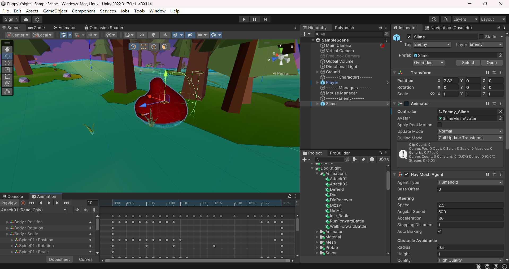

# PuppyKnight

游戏引擎开发课-3D 项目学习

## Tips

vs 多行注释：CTRL+K,CTRL +C  
取消注释： CTRL+K,CTRL+U

### BUG:动画 Read-Only，无法插入事件时



Ctrl + D 复制一个出来，跳出 fbx 文件就可以编辑了

#### Lesson12--FoundPlayer 找到 Player 追击

##### New Features

--Cinemachine FreeLook Camera

--实现滚轮和 AD 键切换视角

#### Lesson18

##### New Features

--添加了 guard 模式和对死亡的判定  
--添加了史莱姆守卫模式和死亡的动画

#### Lesson19

##### New Features

--Singleton and interface study

#### Lesson20

##### New Features

--Observer Pattern Interface Implementation Observer Pattern Subscription.

##### Bug Fixes:

--lesson19 中未在 unity 中创建 GameManager 对象，导致获取游戏对象时抛了空指针异常

##### TODO

--Add more enemies.

#### Lesson21

##### New Features

--Now we have more Enemies,Grunt,Golem.  
--Added generic attribute script by Override it to allow us to quickly create an enemy

##### TODO

Setup more Grunts.

#### Lesson22

##### New Features

--Player Dizzy animation when Attacked by Enemy.
--Animation state machine:Stop NavMeshAgent when Dizzy animation is triggered

Bug Fixes:

--Modified the Grunt's skill trigger distance so that it now triggers the knockback animation properly.

--Lesson21 中的

EnemyController.cs : 77 条件判断错误

```csharp
void OnDisable()
    {
        if (GameManager.IsInitialized)
            return;
        GameManager.Instance.RemoveObserver(this);
    }
```

=>

```csharp
void OnDisable()
    {
        if (!GameManager.IsInitialized) //Modified this line
            return;
        GameManager.Instance.RemoveObserver(this);
    }
```

#### Lesson23

##### Tips

如果出现动画滑动的情况，取消 NavMeshAgent 中的 Auto Braking

##### New Features

--Add Extension Method script which can judge if the attack is facing target.

##### TODO

--Setup Golem

#### Lesson24

##### Tips

```csharp
Vector3 direction = (attackTarget.transform.position - transform.position).normalized;
```

==

```csharp
Vector3 direction = attackTarget.transform.position - transform.position;
    direction.Normalize();
```

##### New Features

--Add up new Enemy Golem which has Powerful Knockout attack.

#### Lesson25

##### Bug Fixes:

//CharacterStats.cs : 85 暴击逻辑判断修改

```csharp
if (isCritical)
        {
            defender.GetComponent<Animator>().SetTrigger("Hit");
        }
```

=>

```csharp
if (attacker.isCritical) //Modified this line
        {
            defender.GetComponent<Animator>().SetTrigger("Hit");
        }
```

##### New Features

Mesh Collider 作用于石头人投出的石头，可以完全贴合素材

#### Lesson26

##### New Features

--现在可以将石头人投出的石头打回去，形成反击
--反击石头时的粒子特效

##### Tips

```csharp
rb.velocity = Vector3.one
```

==

```csharp
rb.velocity = new Vector3(1, 1, 1);
```

人物的 Rigidbody 勾选 is Kinematic=>防止与 NavMeshAgent 冲突

#### Lesson27

##### Tips

1.Unity2020.x 版本之后在 Create 中已移除 Create Sprite，所以在做血条的素材时需要在 Package Manager 中 Install 2D Sprite

2.在人物启动时会调用`OnEnable()`函数

3.`LateUpdate()`在渲染完这一帧之后执行

##### New Features

--增加了血条系统 可以常驻显示，或者设置 VisibleTime，在被攻击()秒内显示血条

--学习了怎么用两个 2D Sprite 自己创建一个简易的血条。

#### Lesson28

##### Tips

Mathf.Clamp
`public static float Clamp (float value, float min, float max);`

|       |                                                                                                  |
| ----- | ------------------------------------------------------------------------------------------------ |
| value | The floating point value to restrict inside the range defined by the minimum and maximum values. |
| min   | 要比较的最小浮点值。                                                                             |
| max   | 要比较的最大浮点值。                                                                             |

返回
`float The float result between the minimum and maximum values.`

##### New Features

--给玩家添加了升级系统,玩家在击败不同的敌人之后可以获得对应的经验值.
--每级的经验逐级递增,升级后回复到最大血量.

#### Lesson29

##### New Features
--通过Canvas和TextMeshPro以及Image组件实现了玩家的等级，血量和经验值的UI显示。
--添加了新的像素字体，美化界面。


##### 创新:原视频中使用 Text 组件，改为 TextMeshPro
[TextMeshPro 官方文档](https://docs.unity3d.com/cn/2021.1/Manual/com.unity.textmeshpro.html)

TextMeshPro更改字体:
1.直接选择字体只有原始自带的字体

2.去商店下载字体

3.去Window-TextMeshPro-Font Asset Creator

4.选择导入的新字体，生成适用于TMP的Assets

5.应用新字体，即可看到效果


```csharp
//PlayerHealthUI.cs
using System.Collections;
using System.Collections.Generic;
using TMPro;    //引用TextMeshPro
using UnityEngine;
using UnityEngine.UI;

public class PlayerHealthUI : MonoBehaviour
{
    TextMeshProUGUI levelText;  //注意要调用的是TextMeshProUGUI而不是TextMeshPro
    //Text levelText;   //原版Text组件
    Image healthSlider;
    Image expSlider;

    void Awake()
    {
        levelText = transform.GetChild(2).GetComponent<TextMeshProUGUI>();
        healthSlider = transform.GetChild(0).GetChild(0).GetComponent<Image>();
        expSlider = transform.GetChild(1).GetChild(0).GetComponent<Image>();
    }

    void Update()
{
    levelText.text = "Level " + GameManager.Instance.playerStats.characterData.currentLevel; //overload ToString方法,使得等级显示为01,02这种
    UpdateHealth();
    UpdateExp();
}
}
```
